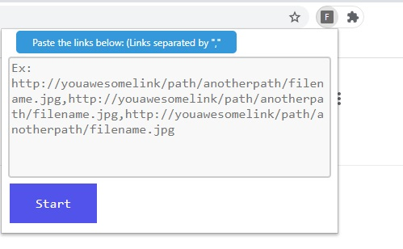

# Extension-chrome-images-downloads
Google chrome extension to download a list of images
# Why?

A friend needed to download a list of images but the computer had limitations, so this is a way to solve the problem for him.

# How it Works

Extension based in MV2 (Manifest v2) 
<strong>To experiment:</strong>

* Open the Extension Management page by navigating to chrome://extensions.
  * Alternatively, open this page by clicking on the Extensions menu button and selecting Manage Extensions at the bottom of the menu.
  * Alternatively, open this page by clicking on the Chrome menu, hovering over More Tools then selecting Extensions
* Enable Developer Mode by clicking the toggle switch next to Developer mode.
* Click the Load unpacked button and select the extension directory.

Text taken from: https://developer.chrome.com/docs/extensions/mv2/getstarted/

# Image:

